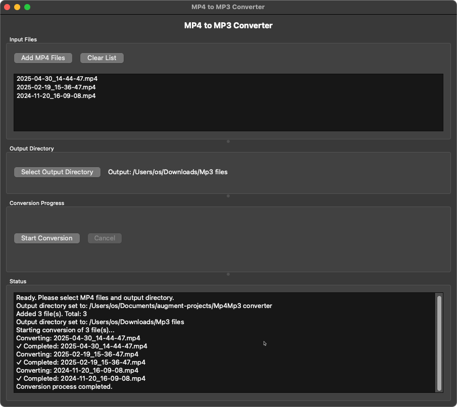

# MP4 to MP3 Converter

A user-friendly simple desktop application for converting MP4 video files to MP3 audio files. Built with Python, PySide6, and moviepy.

## Features

- **Intuitive GUI**: Easy-to-use graphical interface built with PySide6
- **Batch Conversion**: Convert multiple MP4 files at once
- **Progress Tracking**: Real-time progress bar and status updates
- **Error Handling**: Error handling with user-friendly messages
- **File Management**: Easy file selection and output directory management
- **Cross-Platform**: Works on Windows, macOS, and Linux (requires Python)

## Screenshots



The application features a clean, organized interface with:
- File selection area for choosing MP4 input files
- Output directory selection
- Progress tracking with detailed status messages
- Conversion controls with start/cancel functionality

## Requirements

- Python 3.7 or higher
- PySide6 (Qt for Python)
- moviepy (for video/audio processing)
- FFmpeg (automatically installed with moviepy)

## Installation

### Option 1: Using pip (Recommended)

1. **Clone or download this repository**
   ```bash
   git clone <repository-url>
   cd mp4-mp3-converter
   ```

2. **Create a virtual environment (recommended)**
   ```bash
   python -m venv venv
   
   # On Windows:
   venv\Scripts\activate
   
   # On macOS/Linux:
   source venv/bin/activate
   ```

3. **Install dependencies**
   ```bash
   pip install -r requirements.txt
   ```

### Option 2: Manual Installation

Install the required packages individually:
```bash
pip install PySide6 moviepy imageio imageio-ffmpeg
```

## Usage

### Running the Application

1. **Start the application**
   ```bash
   python mp4_to_mp3_converter.py
   ```

2. **Using the interface**
   - Click "Add MP4 Files" to select one or more MP4 video files
   - Click "Select Output Directory" to choose where MP3 files will be saved
   - Click "Start Conversion" to begin the conversion process
   - Monitor progress in the status area and progress bar
   - Use "Cancel" to stop conversion if needed

### Supported Formats

- **Input**: MP4 video files (*.mp4)
- **Output**: MP3 audio files (*.mp3)

The application preserves the original filename but changes the extension to .mp3.

## Features in Detail

### File Selection
- Support for multiple file selection
- Duplicate file detection
- Clear file list functionality
- Visual file list display

### Conversion Process
- Background processing to keep UI responsive
- Real-time progress updates
- Individual file status tracking
- Automatic audio extraction from video

### Error Handling
- Invalid file format detection
- Missing audio track warnings
- Permission and disk space checks
- Detailed error messages in status log

### User Interface
- Resizable window with organized sections
- Progress bar for visual feedback
- Scrollable status log
- Intuitive button layout

## Troubleshooting

### Common Issues

1. **"moviepy library not found" error**
   - Solution: Install moviepy using `pip install moviepy`

2. **FFmpeg not found**
   - moviepy should automatically install FFmpeg
   - If issues persist, install FFmpeg manually from https://ffmpeg.org/

3. **Permission errors**
   - Ensure you have write permissions to the output directory
   - Try selecting a different output directory (e.g., Desktop or Documents)

4. **No audio track found**
   - Some MP4 files may not contain audio tracks
   - Check the original file in a media player to verify audio exists

5. **Conversion fails**
   - Check that the MP4 file is not corrupted
   - Ensure sufficient disk space in output directory
   - Try converting a single file first to isolate issues

### Performance Tips

- **Large files**: Conversion time depends on file size and system performance
- **Batch processing**: Converting many files simultaneously may slow down the process
- **System resources**: Close other applications for better performance

## Technical Details

### Architecture
- **GUI Framework**: PySide6 (Qt for Python)
- **Audio Processing**: moviepy with FFmpeg backend
- **Threading**: QThread for non-blocking conversion
- **Signals/Slots**: Qt's signal-slot system for UI updates

### File Processing
- Uses moviepy's VideoFileClip to load MP4 files
- Extracts audio track using the .audio property
- Saves as MP3 using write_audiofile() method
- Automatic cleanup of video/audio objects

## Development

### Project Structure
```
mp4-mp3-converter/
├── mp4_to_mp3_converter.py    # Main application file
├── requirements.txt           # Python dependencies
├── README.md                 # This file
└── venv/                     # Virtual environment (created during setup)
```

### Contributing
1. Fork the repository
2. Create a feature branch
3. Make your changes
4. Test thoroughly
5. Submit a pull request

## License

This project is open source. Feel free to use, modify, and distribute according to your needs.

## Support

If you encounter issues:
1. Check the troubleshooting section above
2. Ensure all dependencies are properly installed
3. Verify that your MP4 files are valid and contain audio
4. Check the status log in the application for detailed error messages

## Version History

- **v1.0**: Initial release with basic MP4 to MP3 conversion functionality
